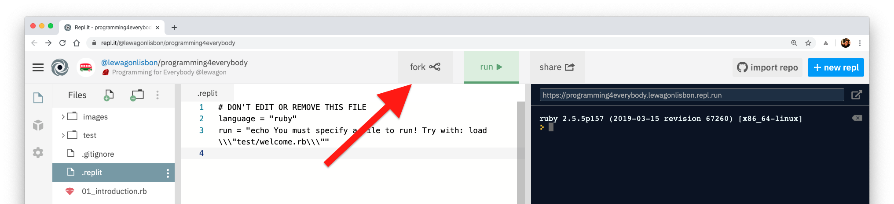

## Welcome!

This repository contains all the files you'll see during the live sessions of the course Programming for Everybody hosted by [Le Wagon](https://www.lewagon.com). Welcome aboard! 🎉

Please star the repository, or just bookmark the page in your favourite browser.

## Usage

Each file you see in this repository will be filled by a teacher during the corresponding session.

You will also find a [`test`](./test) folder in your repository. **Don't edit or delete any file outside this folder**: it's important to always keep your personal experiments in a separate place! 🧪

## Setup

**IMPORTANT:** This is an online learning series, and our teachers won't be able to help you with your computer configuration. If you are just moving your first steps (you don't know Git, Ruby, what a terminal is, or any of the tools we are using), please **[stick to a REPL](#repl)**! Do you want to configure your computer like a pro? [Learn how to do it with us](#going-further)!

### REPL

If you decided to use a [REPL](https://en.wikipedia.org/wiki/Read%E2%80%93eval%E2%80%93print_loop), you can [create an account on Repl.it](https://repl.it/signup) (you can also use your GitHub to sign up).

Once you are logged in, click this button 👉 [](https://repl.it/@lewagonlisbon/programming4everybody) and, if nothing happens automatically, click `fork` to save a copy of this repository in your personal REPLs collection.



Now click on the file `README.md` to open it, and... wait a second, that's me! 🤖


After a session ends, switch to the `Version Control` tab and click `Pull` to get the new changes.


### Git and Ruby

**ONLY** if you already have:

- a GitHub profile
- [Git](https://git-scm.com/book/en/v2/Getting-Started-Installing-Git) installed (type `git --version` in your terminal, it should give you a version >= 1.7)
- [Ruby](https://www.ruby-lang.org/en/documentation/installation) installed (`ruby --version` should be >= 2.2)

you can fork this repository on your computer and fetch the new updates after each session.

First, fork this repository to your profile.


Open your terminal and run the following commands one at a time (always read the comments! 👀):

```sh
# TODO: change with your github username
GITHUB_USERNAME="gabrielecanepa"

# Create a new folder where to keep your personal projects:
[ ! -d ~/code ] && mkdir ~/code
[ ! -d ~/code/$GITHUB_USERNAME ] && mkdir ~/code/$GITHUB_USERNAME
cd ~/code/$GITHUB_USERNAME

# Clone the repository and add the upstream (run JUST ONCE):
git clone https://github.com/$GITHUB_USERNAME/programming4everybody.git
cd programming4everybody
git remote add upstream https://github.com/lewagonlisbon/programming4everybody.git

# Open the repository with your favourite editor:
atom . # or `open -a Atom .`
subl . # or `open -a "Sublime Text" .`
code . # or `open -a "Visual Studio Code" .`
```

Follow the lesson on your editor and play around in the `test` folder.

After each session, you can get the latest updates with:

```sh
git pull -f upstream master
```

## General overview

Our program has 10 lessons, following [Codecademy’s free Ruby track](https://www.codecademy.com/learn/learn-ruby):

1. [`Introduction to Ruby`](./01_introduction.rb) Wednesday, April 8th
2. [`Control flow in Ruby`](./02_control_flow.rb) Friday, April 10th
3. [`Looping with Ruby`](./03_looping.rb) Monday, April 13th
4. [`Arrays and Hashes`](./04_arrays_and_hases.rb) Wednesday, April 15th
5. [`Blocks and Sorting`](./05_blocks.rb) Friday, April 17th
6. [`Hashes and Symbols`](./06_hashes_and_symbols.rb) Monday, April 20th
7. [`Refactoring`](./07_refractoring.rb) Wednesday, April 22nd
8. [`Procs and Lambdas`](./08_procks_and_lambdas.rb) Friday, April 24th
9. [`Object-Oriented Programming, Part 1`](./09_oop.rb) Monday, April 27th
10. [`Object-Oriented Programming, Part 2`](./10_oop.rb) Wednesday, April 29th

## Typical session

- _13h00-13h25_ (GMT+1) **Live session** on [Zoom](https://zoom.us/signup) with Le Wagon's teachers showing lots of live-demos to help you understand the concepts using practical examples
- _13h25-13h45_ (GMT+1) **Q&A session** where you'll be able to ask the teachers any question you might have and share your screen with them for a live help
- _13h45-?_ **Keep coding!** Use the [Slack channel](https://programming4everybody.slack.com) to find a buddy and work with him, interact with other classmates, or just send a funny gif 🙈

For each session, a private link to the Zoom meeting will be shared on the Slack main channel before the beginning of the lesson.

**N.B:** to make the lecture as interactive as possible, we ask you to share your screen with the rest of the participants for **no more than 2 minutes** per session, excluding any extra presentation 🙋🏼‍♀️🙋🏽‍♂️
The Zoom meetings and Slack workspace are **private**, and only authorised participants can access them.

## Going further

Can't wait to know more about programming? **[Apply to Le Wagon](http://www.lewagon.com/lisbon/apply)** and learn how to build the app of your dreams with us 🚀

By completing this course, **you get a special 10% off the next Lisbon course tuition**, and you can combine this discount with any other active scholarship! 🇵🇹 Applications are open for our next batches, check out the dates on our website and [get in touch with our bootcamp manager](https://meetings.hubspot.com/fernando-jardim1).

You can also follow us on [Facebook](https://www.facebook.com/lewagonlisbon), [Instagram](https://www.instagram.com/lewagonlisbon), [Meetup](https://www.meetup.com/Le-Wagon-Lisbon-Coding-Station), and get involved with our amazing community 🤩


